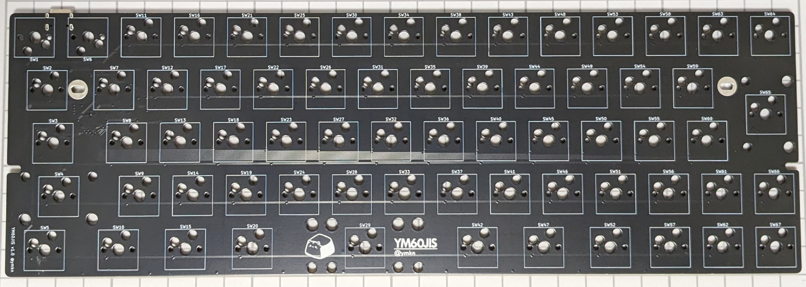
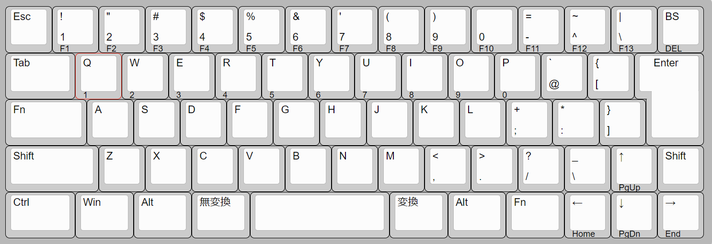

# YM60JIS

A JIS layout 60% hot swappable custom mechanical keyboard PCB powered by RP2040. Suitable for most Poker-compatible 60% keyboard cases.

## Default Layout

You can customize the layout with [Vial](https://get.vial.today/) configurator.

Spacebar can be swappable 3u to 2.25/2.75u with 2u stabilizers if you don't have 3u spacebar and its stabilizers.

## Specification

- MX compatible switches
- USB-C Connector (USB 2.0)
- Hot swappable
- Dimension: 285mm(w) x 94.6mm(h) x 1.6mm(d)
- Suitable for most 60% keyboard cases
  - Warning: center and right bottom mounting holes are not implemented.

## LICENSE

This project is licensed under the MIT License, see the [LICENSE file](LICENSE) for details.
