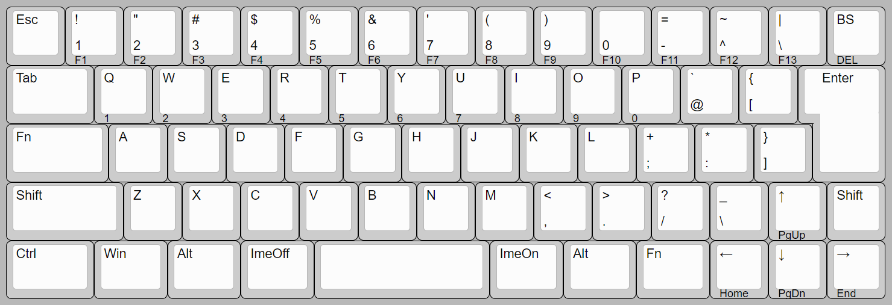

# YM60JIS

A hot-swappable 60% mechanical keyboard PCB with Japanese (JIS) layout, powered by the RP2040 microcontroller. Generally fits most Poker and GH60-style 60% keyboard cases.

## Default Layout / Key Mapping

Customize your key mapping from the default shown below via [Vial](https://get.vial.today/) configurator.

Supports 3u spacebar (requires 3u stabilizers) or 2.25u/2.75u spacebar with 2u stabilizers.

## Specification

- Supports Cherry MX-style switches
- USB Type-C connector (USB 2.0)
- Hot-swap sockets for mechanical switches
- Dimensions: 285 × 94.6 × 1.6 mm (W × H × D)
- Fits most 60% keyboard cases
  - Note: Center and right bottom mounting holes are not present

## Build Guide

See [doc/buildguide.md](doc/buildguide.md)

## LICENSE

This project is licensed under the MIT License, see the [LICENSE file](LICENSE) for details.
