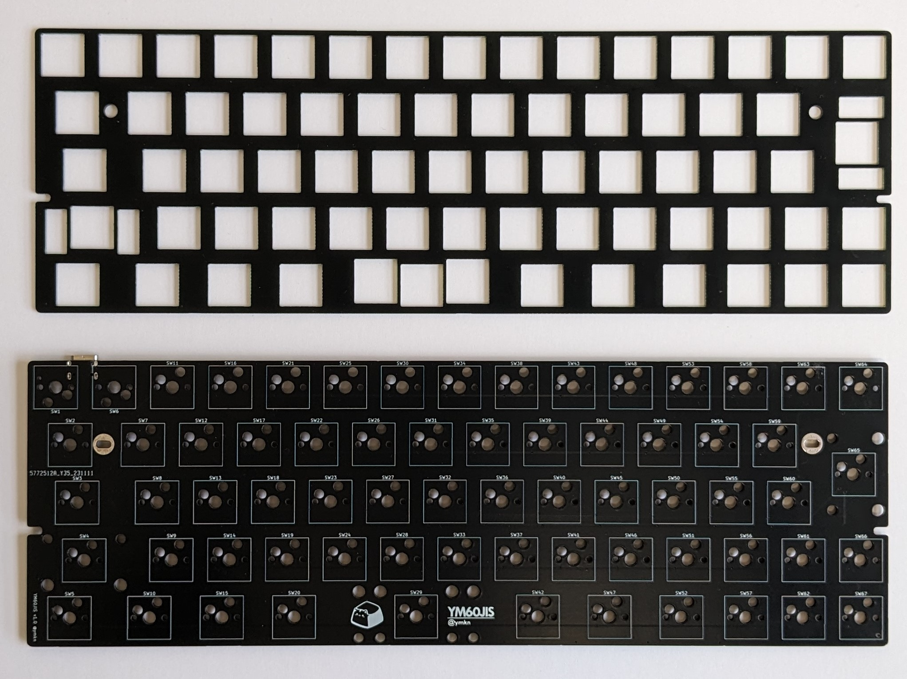
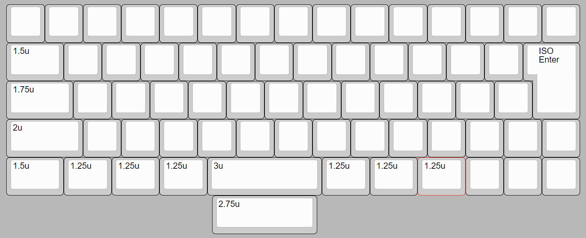
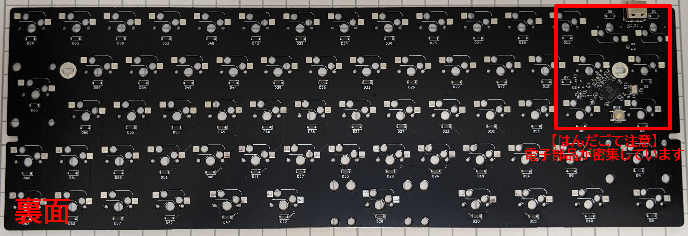
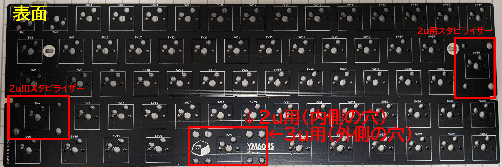
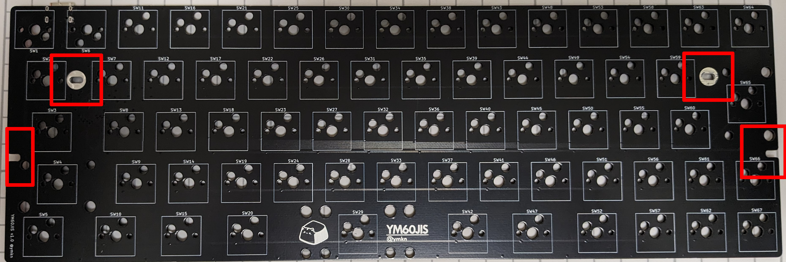

# YM60JIS ビルドガイド

## 1. はじめに

本書は自作キーボード基板であるYM60JISのビルドガイドです。キーボードとして利用可能になるまでの手順を初心者向けに丁寧に記載したつもりですが、不明な個所などある場合は適時検索するなどして補ってください。

申し訳ないのですがYM60JIS固有でない一般のご質問にはお答えできません。各自お調べください。

**キーボード自作経験者向け：** 必要なことはCherry MX用スイッチソケットの調達とそのはんだ付けだけです。ファームウェアはQMKが書き込み済みで、キーマップ変更はVialに対応しています。これでわかればここから先を読む必要はありません。

## 2. 準備

### 2.1 内容物確認

YM60JISは本体となる基板とキースイッチ固定用のトッププレートのセットです。しかし、これだけではキーボードとして使うことができません。その他必要な部品を別途調達いただく必要があります。

|品目|数量|
|---|---|
|YM60JIS 基板|1|
|YM60JIS トッププレート|1|

### 2.2 別途用意が必要な部品

下記部品は国内外の自作キーボード専門店や電子部品販売店などから別途調達してください。

|品目|数量|備考|
|---|---|---|
|MX互換キースイッチ|67|[Cherry MX](https://www.cherrymx.de/en/dev.html)もしくはその互換品|
|MX互換スイッチソケット|67|[Kailh PCB Socket CPG151101S11](https://www.kailhswitch.com/mechanical-keyboard-switches/box-switches/mechanical-keyboard-switches-kailh-pcb-socket.html)もしくはその互換品|
|MX互換キーキャップ|-|[Cherry MX](https://www.cherrymx.de/en/dev.html)もしくはその互換品|
|2uサイズPCBマウント型スタビライザー|2|幅の広いキーの押し下げを安定させる部品です。左ShiftキーとEnterキーに用います|
|2u or 3uサイズPCBマウント型スタビライザー|1|幅の広いキーの押し下げを安定させる部品です。スペースキーに用います。3uスタビライザーと3uスペースキーの組み合わせが推奨です。2uスタビライザーと2.75uスペースキーの組み合わせでも代用可能ですが、隙間が空きます|
|Poker互換60%サイズキーボードケース）|1|Poker互換、60%、GH60対応品、などと称して販売されているトップマウント型のケースが利用できます（※すべてのケースで完全な互換性を保証するものではありません）|

### キーキャップ選択の考え方

#### 日本語JISレイアウト対応のキーキャップについて

まず、日本語JISレイアウト向けの印字を持つ既製品のキーキャップセットは、ほぼ存在しません。

2023年11月現在での入手性の良い選択肢としてはサリチル酸さん作成の[Acid Caps JP](https://salicylic-acid3.hatenablog.com/entry/acid-caps-v3)シリーズと[Keychron社のJIS対応キーキャップセット](https://www.keychron.com/collections/iso-ansi-jis-keycaps)があります。

参考： [自作キーボードに使える日本語配列キーキャップ（2021年12月版） \- NinthSky Studio](https://ninthsky.hatenablog.com/entry/keycap_JP)

そのため大抵の場合は英語圏ANSI/ISOレイアウト向けのキーキャップセットを入手し、実際のキーとは異なる印字のキーキャップを付けることになります。

これらにはひらがなやカタカナが印字されているものもありますが、一部キーの記号位置などを見るとどれもJISレイアウトと異なり、あくまでANSI/ISOレイアウト向けの「飾り」でしかないことがわかります。

#### 必要なキーキャップとサイズ

必要なキーキャップとそのサイズは下図の通りです。キーのサイズは正方形のキーの幅を「1u」と呼称します。2uであれば1uの2倍の幅のキーであることを示します。幅は0.25u刻みで様々なサイズがあります。

このうち、標準的なANSI/ISOレイアウト向けのキーキャップセットに含まれていないか、オプション扱いであることが多い注意すべきキーは次の通りです。オプションを購入するか、同じサイズの別の印字のキーキャップで代替してください。

|行|サイズ|初期レイアウトの対応キー名|
|---|---|---|
|R1|1u|Backspaceキー
|R2/3|ISO Enter|Enterキー|
|R4|2u|左Shiftキー|
|R4|1u|「ろ」の位置のキー|
|R4|1u|右Shiftキー|
|R5|1.25u|無変換、変換、Fn|
|R5|3u|スペースキー|

スペースキーは3uが推奨ですが、3uのスペースキーを用意できない場合は2.75uや2.25uでも代用できます（ただし左右に隙間が空きます）。

### 2.3 道具

|品目|数量|備考|
|---|---|---|
|はんだごて、はんだ|1|スイッチソケットのはんだ付けに用います。はんだごては調温機能付きのものを、はんだは鉛入りのものを推奨します|
|ピンセット|1|スイッチソケットのはんだ付けの際にあると便利です|
|ねじ回し（プラス）|1|基板をケースに固定する際に用います|

## 3. 組み立て

### 3.1 スイッチソケットのはんだ付け

スイッチソケットは基板の裏面（ICチップ等が実装されている面）に取り付けます。L字状のガイドが白線でキー数分印刷されていますので、そのすべてにスイッチソケットをはんだ付けします。

ICチップ近辺のソケットをはんだ付けする際は、はんだごてで電子部品をを焼いてしまわないように気を付けてください。

すべてのスイッチソケットが基板に密着しており、ソケット両端とも漏れなくはんだ付けされているか確認してください。基板から浮いていたり、はんだ付けができていないとキースイッチの動作不良の原因になります。

### 3.2 スタビライザーの取り付け

スタビライザーは基板の表面（ロゴが印刷されている面）に取り付けます。

左ShiftキーとEnterキーに2uサイズを、スペースキーに3uサイズ（2.75u以下のキーを代用する場合は2uサイズ）のスタビライザーを取り付けます。取り付け方はスタビライザーごとに異なりますが、一般には大きい穴の方にツメを引っかけ、小さい穴の方にプッシュピンを差し込む、もしくはネジ留めを行います。

### 3.3 スイッチの取り付け

キースイッチはトッププレートを通して基板のソケットに差し込みます。すべてのキースイッチを一度に取り付けてしまうと基板に差し込むのが大変なので、まずトッププレートの四隅にキースイッチを取り付けて基板に差し込み、その後残りのスイッチを取り付けていくのがおすすめです。

### 3.4 ケースへの取り付け

Poker互換ケースにはネジ穴が6つほどあることが多いですが、本基板で利用できるのはそのうち4つのみとなります（中央と右下のネジ穴は使えません）。また、各ケース微妙にネジ穴やUSBコネクタ用穴の位置が異なるため位置が合わないことがありますが、その場合は留められる穴だけネジ留めしておけば問題ありません。

また、一部のプラ製ケースなどでは構造が基板底面近くまでせり出しているものがあります。本基板はスイッチソケット分の厚みが基板底面から1.8mm程度ありますので、そのような構造と干渉することがあります。ケース側を加工するか、長めのネジに交換するなどの対応をしてください。

基板をケースに取り付けられれば完成です！

## 4. 使用

## 4.1 コンピュータとの接続

お使いのコンピュータのUSB 2.0に対応したUSBコネクタと接続してください。即時利用できるはずです。

## 4.2 キーマップのカスタマイズ

本キーボードは[Vial](https://get.vial.today/)というキーマップ変更ツールに対応しています。Vialの詳しい使いかたはVialのドキュメントや世間の情報を参考にしてください。

### 漢字キー（日本語入力On/Off用のキー）について

本キーボードの初期レイアウトに漢字キーの割り当てはありません。その代わり、スペースキーの左側のキーをImeOffキーに、右側のキーをImeOnキーに割り当てています。ImeOnキーとImeOffキーはWindows 10 1903以降でMicrosoft IMEを使用している場合に利用可能です。漢字キーが必要な場合はレイアウトをカスタマイズして任意のキーに割り当ててください。

参考： [キーボード日本 \- ImeOn / ImeOff の実装 \| Microsoft Learn](https://learn.microsoft.com/ja-jp/windows-hardware/design/component-guidelines/keyboard-japan-ime)

## 5. その他

### 5.1 ブートモードの入り方

RP2040のブートモードに入るには、左上のキー（Tabキー）を押しながらUSBケーブルを接続します。

もしくは、基板裏面のBOOTスイッチを押しながらUSBケーブルを接続します。

### 5.2 ファームウェアのありか

本リポジトリ内で公開しています。

https://github.com/ymkn/YM60JIS/blob/main/firmware/QMK/ymkn_ym60jis_vial.uf2

### 5.3 ソースコード/設計データのありか

本リポジトリ内で公開しています。MITライセンスです。

https://github.com/ymkn/YM60JIS

